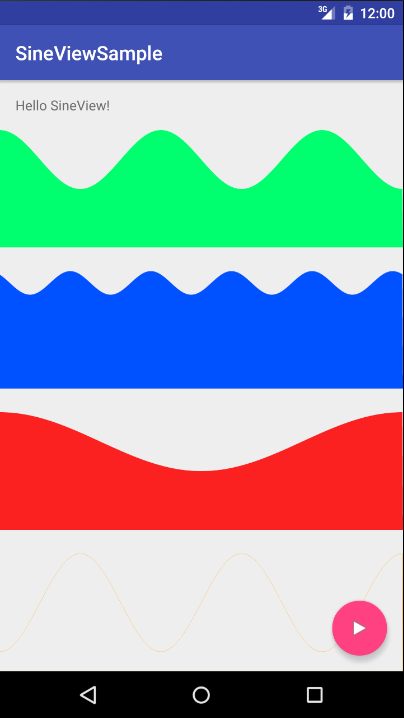
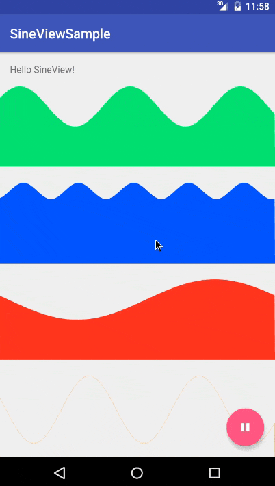

[](https://travis-ci.org/guiguegon/SineView)
[](https://jitpack.io/#guiguegon/SineView)

# SineView
SineView allows you to paint and animate a sine

## Download
Add the following dependency to your gradle file
```java
compile 'es.guiguegon:sineview:1.0.0'
```

or use JitPack [](https://jitpack.io/#guiguegon/SineView)

## Usage
The minimum API is 11.

```xml
<es.guiguegon.sineview.SineView
            android:id="@+id/sine_view"
            android:layout_width="match_parent"
            android:layout_height="100dp"
            app:sv_sine_amplitude="30dp"
            app:sv_sine_animation_time_millis="3000"
            app:sv_sine_color="@color/green"
            app:sv_sine_periods_to_show="2.5"
            app:sv_sine_phase="1"/>
```
To start the animation simply use the methods **startWave** or **resumeWave**.
To pause the animation: **pauseWave**
To finish and set the initial state: **stopWave**

## Parameters to customize

- sv_sine_alpha: to apply an alpha to the sine (0-1)
- sv_sine_phase: Sine phase parameter
- sv_sine_amplitude: Sine amplitude parameter
- sv_sine_animation_time_millis: the animation time 
- sv_sine_periods_to_show: Sine period parameter 
- sv_sine_color: Sine color
- sv_sine_fill: fill the sine or just paint the stroke (boolean)


## Screenshots




License
=======

    Copyright 2016 Guillermo Guerrero González

    Licensed under the Apache License, Version 2.0 (the "License");
    you may not use this file except in compliance with the License.
    You may obtain a copy of the License at

       http://www.apache.org/licenses/LICENSE-2.0

    Unless required by applicable law or agreed to in writing, software
    distributed under the License is distributed on an "AS IS" BASIS,
    WITHOUT WARRANTIES OR CONDITIONS OF ANY KIND, either express or implied.
    See the License for the specific language governing permissions and
    limitations under the License.
 